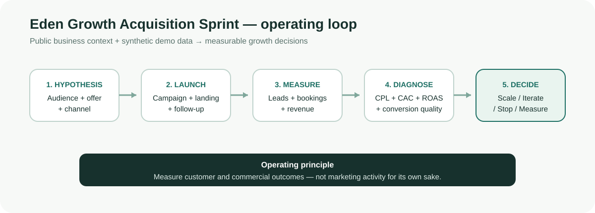

# Eden Growth Acquisition Sprint

**Founder-ready customer-acquisition and growth experimentation prototype**

Eden Growth Acquisition Sprint is an independent Streamlit case study built around a practical early-stage growth question:

> **With limited budget and limited time, which audience + offer + channel + landing journey should be tested first, what did it cost, what converted, and what should be scaled, iterated or stopped next?**

This is intentionally not a generic marketing dashboard. The app is structured as an operating loop from growth hypothesis to commercial decision.



## Important data disclaimer

This repository does **not** use Eden Therapy Clinic internal analytics, ad-account data, CRM data, booking records, customer data or revenue results.

- Public Eden Therapy Clinic pages are used only for business context.
- Campaign, lead, customer, spend and revenue numbers bundled with the app are **synthetic demonstration data**.
- Example campaign outcomes are not forecasts or claims about Eden performance.
- The app can accept a campaign CSV so the same workflow can be reused with validated first-party exports when access is available.

## Why this project exists

The target Growth Marketer role emphasises:

- customer acquisition and lead generation
- Meta / paid-social and Google Ads / PPC thinking
- SEO and content
- social growth
- landing-page and conversion optimisation
- email / CRM lifecycle
- referrals, partnerships and community growth
- A/B testing and growth experiments
- analytics, KPIs and performance reporting

The project brings those areas into one measurable workflow rather than treating them as separate marketing activities.

## App workspace

| Workspace | Business question |
| --- | --- |
| **Growth command centre** | What did we spend, what converted, and what deserves action now? |
| **Acquisition channels** | Which channels produce customers at acceptable downstream economics? |
| **Experiment studio** | Can one audience/message/landing hypothesis be turned into a measurable test? |
| **Conversion & A/B testing** | Did the variant actually improve the conversion rate, and by how much? |
| **SEO & content** | Which search intents are closest to a commercial customer action? |
| **CRM & retention** | What should happen after the first booking to support repeat behaviour? |
| **Partnerships & referrals** | Can offline/community trust become a trackable acquisition source? |
| **30-day sprint** | What should be measured, tested, diagnosed and reallocated in the first month? |

## Core growth metrics

The command centre calculates the commercial chain rather than stopping at clicks:

```text
Spend
  ↓
Clicks / visits
  ↓
Leads / booking starts
  ↓
Customers / completed bookings
  ↓
Revenue
  ↓
Repeat behaviour
```

Key metrics include:

- CTR
- cost per click
- lead conversion rate
- cost per lead
- lead-to-customer conversion
- customer acquisition cost (CAC)
- return on ad spend (ROAS)
- repeat-customer rate

Ratios are calculated after aggregation so channel-level economics are not simple averages of campaign ratios.

## Decision engine

For synthetic/demo paid campaigns, the project applies explicit rules:

- **SCALE** — strong ROAS **and** strong lead-to-customer conversion.
- **ITERATE** — promising, but the current constraint should be fixed before scaling.
- **STOP** — weak downstream economics or conversion.
- **MEASURE** — organic/no-spend activity where paid-media ROAS is not meaningful.

The defaults are deliberately inspectable in `src/growth.py`. They are **not** claimed to be Eden's real business thresholds. A production version should set thresholds from gross margin, capacity, cash flow, repeat behaviour and strategic constraints.

## Experiment design

The Experiment Studio uses a simple operator brief:

```text
Audience
+ Channel
+ Message / creative
+ Landing experience
+ Follow-up
+ Primary metric
+ Guardrail
→ observed result
→ Scale / Iterate / Stop
```

This avoids a common failure mode where a campaign is considered "successful" because it generated engagement while the booking/customer economics remain weak.

## A/B testing

The conversion workspace does **not** assume or promise an uplift.

It calculates:

```text
Control conversion rate
Variant conversion rate
Absolute percentage-point change
Relative uplift
```

The output is explicitly descriptive. It does not auto-declare statistical significance. A real experiment should be sized in advance and interpreted with the test design, duration, traffic quality and guardrail metrics.

## SEO and content

The SEO section uses public business context to propose **intent-to-conversion** opportunities. It deliberately does not invent search volume, rankings or traffic.

Example logic:

```text
Search intent
→ intent-matched service / content page
→ reduced uncertainty
→ one clear booking / purchase action
→ measured conversion
```

## CRM and retention

The lifecycle design uses customer behaviour states rather than a broadcast calendar:

```text
High-intent visitor / lead
→ booked customer
→ completed appointment
→ relevant next step
→ repeat booking
→ lapsed-customer reactivation when appropriate
```

The business outcome is repeat booking / reactivation, not email opens alone.

## Partnerships and referrals

The project treats partnerships as measurable acquisition hypotheses:

```text
Partner / referral source
→ tagged link or code
→ landing experience
→ booking / purchase
→ first revenue
→ repeat behaviour
```

## Public business context

The case study references only publicly accessible information, including:

- Eden Therapy Clinic home / location: https://www.edentherapyclinic.ie/
- public treatment pricing: https://www.edentherapyclinic.ie/pricing?category=massage-therapy
- public signature packages: https://www.edentherapyclinic.ie/packages
- public gift-card / voucher page: https://www.edentherapyclinic.ie/gift-card

Public observations are stored separately from proposed strategy in `src/content.py`.

## Synthetic demo dataset

`data/demo_campaigns.csv` contains clearly labelled `DEMO |` campaigns across:

- Google Search
- Meta Paid Social
- Organic Search
- Referral
- Partnership
- Email / CRM

The data exists so the app is interactive before any private first-party data is available.

### Bring your own campaign export

The command-centre and channel views accept a CSV with:

```text
campaign
channel
objective
spend
impressions
clicks
leads
customers
revenue
repeat_customers
```

The uploaded file is validated before calculations run.

## 30-day operating plan

The sprint is structured as:

```text
Week 1: Baseline
Week 2: Launch small tests
Week 3: Diagnose the constraint
Week 4: Reallocate toward validated winners
```

The end-of-month deliverable is a learning and decision record — not a list of marketing tasks completed.

## Technology

- Python
- Streamlit
- Pandas
- NumPy
- Plotly
- Pytest
- GitHub Actions

## Repository structure

```text
eden-growth-acquisition-sprint/
├── app.py
├── src/
│   ├── __init__.py
│   ├── growth.py
│   └── content.py
├── data/
│   └── demo_campaigns.csv
├── tests/
│   └── test_growth.py
├── assets/
│   └── architecture.svg
├── .streamlit/
│   └── config.toml
├── .github/
│   └── workflows/
│       └── tests.yml
├── requirements.txt
├── requirements-dev.txt
└── README.md
```

## Run locally

```bash
git clone https://github.com/iamabhishek841/eden-growth-acquisition-sprint.git
cd eden-growth-acquisition-sprint

python -m venv .venv
# Windows: .venv\Scripts\activate
# macOS/Linux: source .venv/bin/activate

pip install -r requirements.txt
streamlit run app.py
```

## Run tests

```bash
pip install -r requirements-dev.txt
PYTHONPATH=. python -m pytest -q
```

On Windows PowerShell:

```powershell
$env:PYTHONPATH="."
python -m pytest -q
```

GitHub Actions runs the test suite on every push and pull request.

## Streamlit Community Cloud deployment

1. Open Streamlit Community Cloud.
2. Create a new app from this GitHub repository.
3. Select branch `main`.
4. Set the main file path to `app.py`.
5. Deploy.

No secrets are required for the current demo version.

## Design principles

1. **Commercial outcome before vanity metric.**
2. **No invented company performance.**
3. **Public observations, proposed strategy and synthetic data stay separate.**
4. **One experiment = one primary growth question.**
5. **CAC / conversion / revenue quality matter more than cheap traffic alone.**
6. **A/B uplift is measured after the test, not promised before it.**
7. **Every meaningful test ends with a decision: scale, iterate, stop or keep measuring.**
8. **The tool should help a founder decide what to do next, not create reporting theatre.**

## Limitations

This is a portfolio prototype, not a connected marketing platform.

It does not currently:

- manage live Meta or Google Ads accounts
- pull GA4 / Search Console data
- send CRM or email messages
- connect to Eden booking or payment systems
- infer profitability from unknown margin/capacity data
- claim causal incrementality from observational campaign metrics

A production implementation would connect validated first-party systems, define commercial thresholds with the business, and preserve the same hypothesis → measure → decision loop.

---

Eden Therapy Clinic is a third-party business and is not affiliated with this repository. Brand and service references are used only to explain the independent portfolio case study.
